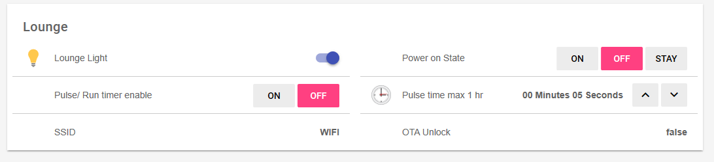
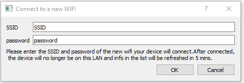

# SONOFF_DIY

Sonoff Diy Turorial for openHAB official firmware version 3.3.0



This is how I got the sonoff DIY mode to work with openhab. It is a work in progress as I am still learning. It is for the DIY'er that can create and edit files in openhab.

It's working with:

* **[SONOFF BASICR3](https://www.itead.cc/sonoff-basicr3-wifi-diy-smart-switch.html)** - WIFI DIY Smart Switch
* **[SONOFF MINI](https://www.itead.cc/sonoff-mini.html)** - Two Way Smart Switch

## Prerequisites

* [x] openHAB installed - [Guide](https://www.openhab.org/docs/installation/)


</br>

* [x] Sonoff wired and powered

* [x] Updated to the latest firmware using **[eWeLink](https://sonoff.tech/ewelink) -  3.3.0**
* [x] Install DIY header after updating firmware
* [x] Create wifi network for sonoff to connect to using [Itead Instructions](https://github.com/itead/Sonoff_Devices_DIY_Tools/blob/master/other/SONOFF%20DIY%20MODE%20Protocol%20Doc%20v1.4.md#set-up-the-diy-mode-operating-environment)

<blockquote>

### Set up the DIY MODE operating environment

#### 1. LAN（WiFi）requirement and setting

Requirement: 2.4GHz wifi and support mDNS service

Setting：

WiFi SSID: `sonoffDiy`

WiFi password: `20170618sn`
</blockquote>

* [x] Download Itead's [DIY tool_01DIY85(3.3.0).exe](https://github.com/itead/Sonoff_Devices_DIY_Tools/raw/master/tool/tool_01DIY85(3.3.0).exe)
You may need to install https://www.python.org/

* [x] Run the tool on a computer that is on the same newtork as the sonoff. Test Sonff with the DIY tool to make sure everything works.

* [x] Change the network setting on the Sonoff to put it on your network with openhab running.



* [x] Use DHCP to assign static ip address

* [x] Be able create and edit openhab config files. I edit files using [VS Code](https://code.visualstudio.com/) (FREE) with [extention.](https://marketplace.visualstudio.com/items?itemName=openhab.openhab)

## API PROTOCOL

For a full understanding of api you can read the [Sonoff Guide](https://github.com/itead/Sonoff_Devices_DIY_Tools/blob/master/other/SONOFF%20DIY%20MODE%20Protocol%20Doc%20v1.4.md#diy-mode-description)

The bit we need to turn it on and off is that you post json data to sonoff

``` JSON
http://192.168.1.50:8081/zeroconf/switch


{ 
	"deviceid": "100098757f", 
	"data": {
    	"switch": "on" 
    } 
 }
```

in openhab I do it with a **executeCommandLine()** [Action](https://www.openhab.org/docs/configuration/actions.html#exec-actions). I run openhabian on rpi 3b so the command I run is curl.

``` JAVA
executeCommandLine(curl@@-sSH@@"Accept: */*"@@-H@@"Content-Type: text/plain"@@-X@@POST@@-d@@'{"deviceid": "100098757f", "data": {"switch": "on"}'@@' http://192.168.1.50:8081/zeroconf/switch

```

Executing this in a rule should turn your sonoff on.

## Sonoff Funtions Explained

### on off

Self explanatory turns relay on and off (lower case)

### Power on state

| Attribute | Description                                                  |
| :-------: | :------: | :-----------------------------------------------------------|
|  startup  | **on:** the device is on when power supply is recovered. <br/>**off:** the device is off when power supply is recovered. <br/>**stay:** the device status keeps as the same as the state before power supply is gone |

### Pulse

When the pulse / delay off timer is enabled on the sonoff it will automaticy shut off after the desierd time (pulseWidth)  

#### e.g. Sensor light

  If used for external flood light you can setup a motion sensor to trigger sonoff to turn on. After the disired time it will turn off automaticly. It can also be turned on and off via openhab to turn on all the time during a party.  

| Attribute  | Description                                                  |
| :--------: | :----: | :------: | :----------------------------------------------------------- |
|   pulse    | **on:** activate the inching function; <br/>**off:** disable the inching function |
| pulseWidth | Required when "pulse" is on, pulse time length, positive integer, ms, only supports multiples of 500 in range of 500~36000000 |


## Config Files

I installed my sonoff_one controling my lounge room light and as an example.

### Items

 sonoff.items file located in items folder

```java 
//  Sonoff One Located in the Lounge Room

Switch sonoff_one "Lounge Light" <switch> (gLounge) [ "Lighting" ]
String sonoff_one_startup "Startup"
String sonoff_one_pulse "Pulse"
Number sonoff_one_pulseWidth 
String sonoff_one_ssid "SSID"
String sonoff_one_otaUnlock "OTA Lock"
```

You can add all of your Sonoff's into this one item file. Tagging it with [ "Lighting" ] allows me to control it with my google home.

### Sitemap

Example sonoff.sitemap file locaded in sitemaps folder

```java
sitemap sonoff label="sonoff_one" {
  Frame label="Lounge" {
    Switch item=sonoff_one icon="light"
    Switch item=sonoff_one_startup label="Power on State" icon="none" mappings=[on="ON",off="OFF",stay="KEEP"]
    Switch item=sonoff_one_pulse icon="none" label="Pulse/ Run timer enable" mappings=[on="ON",off="OFF"]
    Setpoint item=sonoff_one_pulseWidth icon="time" label="Pulse time max 1 hr [JS(msToTime.js):%s]" minValue=1000 maxValue=36000000 step=1000 
    Text item=sonoff_one_ssid icon="none" label="SSID [%s]"
    Text item=sonoff_one_otaUnlock icon="none" label="OTA Unlock [%s]"
  }

}

```

I don't want to display my Pulse timer in ms so I transform the data using JS(msToTime.js): transformation.

### Transform

Example msToTime.js file located in transfom directory

``` java
(function msToTime(i) {
    var milliseconds = parseInt(i)

    //Get hours from milliseconds
    var hours = milliseconds / (1000*60*60);
    var absoluteHours = Math.floor(hours);
    var h = absoluteHours > 9 ? absoluteHours : '0' + absoluteHours;

    //Get remainder from hours and convert to minutes
    var minutes = (hours - absoluteHours) * 60;
    var absoluteMinutes = Math.floor(minutes);
    var m = absoluteMinutes > 9 ? absoluteMinutes : '0' +  absoluteMinutes;

    //Get remainder from minutes and convert to seconds
    var seconds = (minutes - absoluteMinutes) * 60;
    var absoluteSeconds = Math.floor(seconds);
    var s = absoluteSeconds > 9 ? absoluteSeconds : '0' + absoluteSeconds;

    return h == "00" ? m + ' Minutes ' + s + ' Seconds ' : h + 'Hour' + m + ' Minutes' + s + ' Seconds';
})(input)

```

This transforms ms to hr min sec for easier reading.

### Rule

sonoff_one.rules file located in the rules folder. Create a rule file for each sonoff controled. You need to change some setting to make it work. Change the IP, device id and item names. Each rule in openhab need a unique name. 

```JAVA

import org.eclipse.smarthome.model.script.ScriptServiceUtil

val String Ip = '192.168.1.50'      // Ip of Sonoff or mDNS eWeLink_100098757f.local
val String Deviceid = '100098757f'              // Can get from DIY tool 

//-----------------------------------------------------Item Name
val sonoff = ScriptServiceUtil.getItemRegistry.getItem("sonoff_one")
val startup = ScriptServiceUtil.getItemRegistry.getItem("sonoff_one_startup")
val pulse = ScriptServiceUtil.getItemRegistry.getItem("sonoff_one_pulse")
val pulseWidth = ScriptServiceUtil.getItemRegistry.getItem("sonoff_one_pulseWidth")
val ssid = ScriptServiceUtil.getItemRegistry.getItem("sonoff_one_ssid")
val otaUnlock = ScriptServiceUtil.getItemRegistry.getItem("sonoff_one_otaUnlock")
var String Last_update

rule "Sonoff_one control Rule"

  when
    Item sonoff_one received command  // The Item name for your Switch 
  then
  
  try {

      var CommandState = sonoff.state.toString.toLowerCase   
      var CommandURL = 'http://' + Ip +':8081/zeroconf/switch'
      var String CommandData = '{"deviceid": "' + Deviceid + '", "data": {"switch": "' + CommandState + '"}}'
      var String UpdateResult
      var Number Attempts = 0
      var CommandExec = 'curl@@-sSH@@"Accept: */*"@@-H@@"Content-Type: text/plain"@@-X@@POST@@-d@@' + CommandData + '@@' + CommandURL
    
    do {
      Attempts += 1
      // logInfo("Sonoff command", CommandData)
      UpdateResult = executeCommandLine(CommandExec, 1500)
        
      if (UpdateResult.contains('"error":0')) { logInfo("Sonoff ID:"+ Deviceid +" Control", "IP: " + Ip + " Turned: " + CommandState) } // Success
     
  
    } while (!UpdateResult.contains('"error":0') && Attempts < 3) // Attempt to send 5 times
  
    if (Attempts == 3) {
      logError("Sonoff control Rule", "3 failures updating Sonoff")
    }
          
    if (UpdateResult.contains('"error":400')) {
      logError("Sonoff ID:"+ Deviceid +" Error", "The operation failed and the request was formatted incorrectly. The request body is not a valid JSON format")
    } else if  (UpdateResult.contains('"error":401')) {
      logError("Sonoff Error", "The operation failed and the request was unauthorized. Device information encryption is enabled on the device, but the request is not encrypted")
    } else if (UpdateResult.contains('"error":404')) {
      logError("Sonoff Error", "The operation failed and the device does not exist. The device does not support the requested deviceid")
    } else if (UpdateResult.contains('"error":422')) {
      logError("Sonoff Error", "The operation failed and the request parameters are invalid. For example, the device does not support setting specific device information")
    }
    } 
    catch(Exception e){
        logError("Control", "Error occured in Control Rule! " + e.toString)
    }
 
end

rule "Sonoff_one Power ON state Rule"

  when
    Item sonoff_one_startup received command 
  then

  try {
    
      var CommandState = sonoff_one_startup.state 
      var CommandURL = 'http://' + Ip +':8081/zeroconf/startup'
      var String CommandData = '{"deviceid": "' + Deviceid + '", "data": {"startup": "' + CommandState + '"}}'
      var String UpdateResult
      var Number Attempts = 0
      var CommandExec = 'curl@@-sSH@@"Accept: */*"@@-H@@"Content-Type: text/plain"@@-X@@POST@@-d@@' + CommandData + '@@' + CommandURL

 
    do {
      Attempts += 1
      // logInfo("Sonoff command", CommandData)
      UpdateResult = executeCommandLine(CommandExec, 1500)
        
      if (UpdateResult.contains('"error":0')) { logInfo("Sonoff ID:"+ Deviceid +" Control", "IP: " + Ip + " Turned: " + CommandState) } // Success
     
  
    } while (!UpdateResult.contains('"error":0') && Attempts < 3) // Attempt to send 5 times
  
    if (Attempts == 3) {
      logError("Sonoff Power ON state Rule", "3 failures updating Sonoff")
    }
          
    if (UpdateResult.contains('"error":400')) {
      logError("Sonoff ID:"+ Deviceid +" Error", "The operation failed and the request was formatted incorrectly. The request body is not a valid JSON format")
    } else if  (UpdateResult.contains('"error":401')) {
      logError("Sonoff Error", "The operation failed and the request was unauthorized. Device information encryption is enabled on the device, but the request is not encrypted")
    } else if (UpdateResult.contains('"error":404')) {
      logError("Sonoff Error", "The operation failed and the device does not exist. The device does not support the requested deviceid")
    } else if (UpdateResult.contains('"error":422')) {
      logError("Sonoff Error", "The operation failed and the request parameters are invalid. For example, the device does not support setting specific device information")
    }
    } 
    catch(Exception e){
        logError("state", "Error occured in on state Rule! " + e.toString)
    }
 
end

rule "Sonoff_one Pulse Rule"

  when
    Item sonoff_one_pulse received command or 
    Item sonoff_one_pulseWidth received command
  then

  try {

      var CommandState = pulse.state 
      var CommandTime = pulseWidth.state.toString 
      var CommandURL = 'http://' + Ip +':8081/zeroconf/pulse'
      var String CommandData = '{"deviceid": "' + Deviceid + '", "data": {"pulse": "' + CommandState + '", "pulseWidth":' + CommandTime +'}}'
      var String UpdateResult
      var Number Attempts = 0
      var CommandExec = 'curl@@-sSH@@"Accept: */*"@@-H@@"Content-Type: text/plain"@@-X@@POST@@-d@@' + CommandData + '@@' + CommandURL

    do {
      Attempts += 1
      // logInfo("Sonoff command", CommandData)
      UpdateResult = executeCommandLine(CommandExec, 1500)
        
      if (UpdateResult.contains('"error":0')) { logInfo("Sonoff ID:"+ Deviceid +" Pulse", "IP: " + Ip + " State: " + CommandState + "  Time  :" + CommandTime) } // Success
     
  
    } while (!UpdateResult.contains('"error":0') && Attempts < 3) // Attempt to send 5 times
  
    if (Attempts == 3) {
      logError("Sonoff Pulse Rule", "3 failures updating Sonoff")
    }
          
    if (UpdateResult.contains('"error":400')) {
      logError("Sonoff ID:"+ Deviceid +" Error", "The operation failed and the request was formatted incorrectly. The request body is not a valid JSON format")
    } else if  (UpdateResult.contains('"error":401')) {
      logError("Sonoff Error", "The operation failed and the request was unauthorized. Device information encryption is enabled on the device, but the request is not encrypted")
    } else if (UpdateResult.contains('"error":404')) {
      logError("Sonoff Error", "The operation failed and the device does not exist. The device does not support the requested deviceid")
    } else if (UpdateResult.contains('"error":422')) {
      logError("Sonoff Error", "The operation failed and the request parameters are invalid. For example, the device does not support setting specific device information")
    }
    } 
    catch(Exception e){
       logError("pulse", "Error occured in Pulse Rule! " + e.toString)
    }

end

rule "Sonoff_one Polling"

  when
    Time cron "0/3 * * * * ?" // Run every 3 seconds
  then
  
  try {

        var CommandURL = 'http://' + Ip +':8081/zeroconf/info'
        var String CommandData = '{"deviceid": "'+ Deviceid +'", "data": {}}'
        var String UpdateResult
        var Number Attempts = 0
        var CommandExec = 'curl@@-sSH@@"Accept: */*"@@-H@@"Content-Type: text/plain"@@-X@@POST@@-d@@' + CommandData + '@@' + CommandURL
        var String JSONdata
        var String update_sswitch
        var String update_startup
        var String update_pulse
        var String update_pulseWidth
        var String update_ssid
        var String update_otaUnlock


    do {
        Attempts += 1
        // logInfo("Sonoff command", CommandData)
        UpdateResult = executeCommandLine(CommandExec, 1500)

      if (UpdateResult.contains('"error":0')) { 
        JSONdata = transform("JSONPATH", "$.data", UpdateResult)      
        // logInfo("Sonoff Poll JSONdata", JSONdata)


      if (JSONdata != Last_update) {
       
          update_sswitch = transform("JSONPATH", "$.switch", JSONdata)
          update_startup = transform("JSONPATH", "$.startup", JSONdata)
          update_pulse = transform("JSONPATH", "$.pulse", JSONdata)
          update_pulseWidth = transform("JSONPATH", "$.pulseWidth", JSONdata)
          update_ssid = transform("JSONPATH", "$.ssid", JSONdata)
          update_otaUnlock = transform("JSONPATH", "$.otaUnlock", JSONdata)

          if (update_sswitch != sonoff.state.toString.toLowerCase) {
            logInfo("sonoff switch", " Syncing state to " + update_sswitch)
            sonoff.postUpdate(update_sswitch.toString.toUpperCase)
          }

          if (update_startup != startup.state.toString) {
            logInfo("sonoff switch", " Syncing startup to " + update_startup)
            startup.postUpdate(update_startup.toString)
          }
          
          if (update_pulse != pulse.state.toString) {
            logInfo("sonoff switch", " Syncing pulse to " + update_pulse )
            pulse.postUpdate(update_pulse.toString)
          }
          
          if (update_pulseWidth != pulseWidth.state.toString) {
            logInfo("sonoff switch", " Syncing pulseWidth to " + update_pulseWidth + "ms")
            pulseWidth.postUpdate(update_pulseWidth.toString)
          }
          
          if (update_ssid != ssid.state.toString) {
            logInfo("sonoff switch", " Syncing ssid")
            ssid.postUpdate(update_ssid.toString)
          }
          
          if (update_otaUnlock != otaUnlock.state.toString) {
            logInfo("sonoff switch", " Syncing otaUnlock")
            otaUnlock.postUpdate(update_otaUnlock.toString)
          }
          
          Last_update = JSONdata
          }     
        }    
  
      } while (!UpdateResult.contains('"error":0') && Attempts < 2) // Attempt to send 2 times

    if (Attempts == 2) {
      logError("Sonoff Poll Switch", "2 failures polling sonoff_one ")
    }
      
        if (UpdateResult.contains('"error":400')) {
          logError("Sonoff ID:"+ Deviceid +" Error", "The operation failed and the request was formatted incorrectly. The request body is not a valid JSON format")
        } else if  (UpdateResult.contains('"error":401')) {
          logError("Sonoff Error", "The operation failed and the request was unauthorized. Device information encryption is enabled on the device, but the request is not encrypted")
        } else if (UpdateResult.contains('"error":404')) {
          logError("Sonoff Error", "The operation failed and the device does not exist. The device does not support the requested deviceid")
        }    else if (UpdateResult.contains('"error":422')) {
          logError("Sonoff Error", "The operation failed and the request parameters are invalid. For example, the device does not support setting specific device information")
        }
    
    }
    catch(Exception e){
      logError("Polling", "Error occured in Sonoff Poling Rule! " + e.toString)
    }

end  


```
